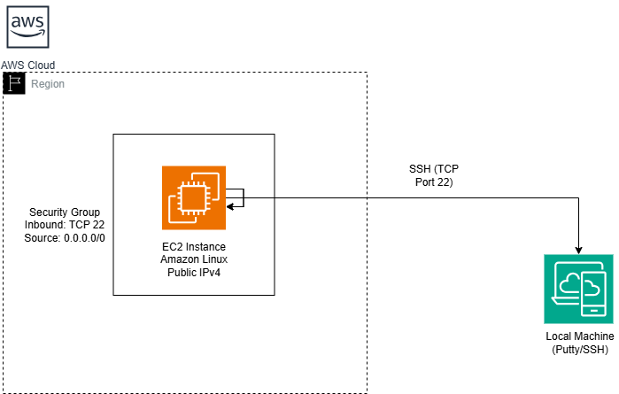

# Launching an EC2 Instance and Connecting via SSH

This repository documents the process of launching a simple Amazon EC2 instance, configuring a security group that allows inbound SSH traffic (port 22 only), and connecting to the instance securely using SSH. The project is intended for beginners who are learning cloud infrastructure fundamentals and basic remote server access.

# Technologies Used

AWS Management Console – for provisioning the EC2 instance and networking resources

PuTTY – for establishing an SSH connection from a Windows environment

# Features

Secure remote access to an EC2 instance using SSH

Security group configured with the principle of least privilege (SSH access only)

Ability to manage a cloud-based server from anywhere

This setup demonstrates how cloud servers can be administered remotely, making infrastructure management flexible and efficient.

# What I Learned

Through this project, I learned that an EC2 instance is essentially a virtual server hosted in the cloud. It can be:

Scaled vertically by changing the instance type

Scaled horizontally by adding more instances

I learned that When establishing an SSH connection, the EC2 instance listens on port 22,
while the client machine uses a dynamically assigned ephemeral source port. The following commands helps to find out 
which port is used to establish a ssh connection between the client computer and the ec2 instance:
For windows (Powershell): netstat -ano | findstr :22
For linux or macOS: netstat -tnp | grep :22

I also learned that EC2 instances can be created on demand in less than a minute, which makes them far more practical and efficient than procuring, setting up, and maintaining physical servers.

# Possible Improvements

This project can be enhanced in several ways:

Add a monitoring or logging script to track which users (and IP addresses) connect to the EC2 instance

Provision the infrastructure using Terraform instead of manual configuration via the AWS Console

Replace SSH access with AWS Systems Manager (SSM) for improved security and auditing

# Running the Project

Not applicable. This repository focuses on infrastructure provisioning and remote access rather than application execution.

## Architecture Diagram

## Video

https://github.com/user-attachments/assets/8638e784-e63c-4d8a-a67b-adbd121929e0

